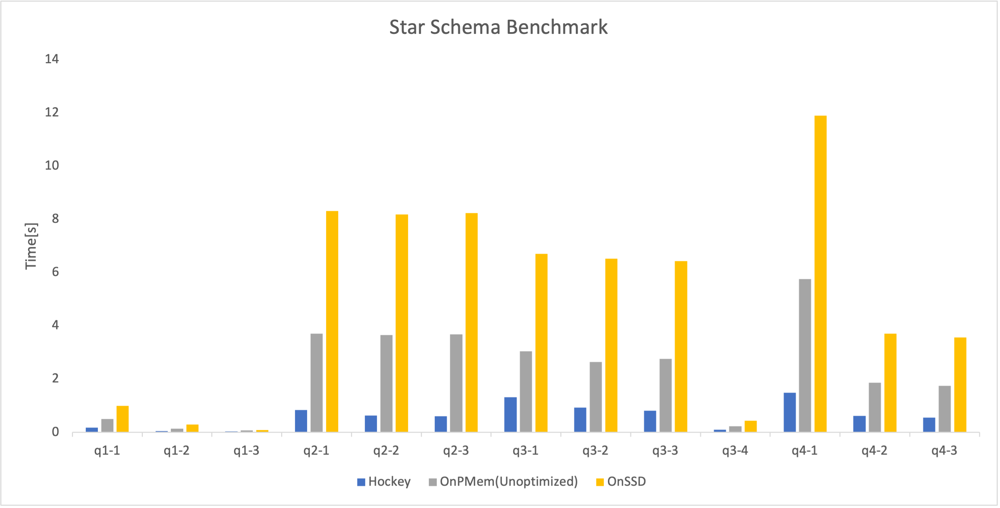

# Hockey

Hockey is a hybrid PMem-SSD storage engine for analytical database.

The code base for Hockey is [ClickHouse](https://github.com/ClickHouse/ClickHouse).

## Build

Please reference [here](/docs/en/development/build.md). In addition, the following librarys are needed.
* [PMDK](https://github.com/pmem/pmdk)
* [libpmemobj-cpp](https://github.com/pmem/libpmemobj-cpp)

## Benchmark

Part of the benchmark results were performed under star schema benchmark.

## Publication

* Yuhang Jia, Huiqi Hu, Xuan Zhou, and Weining Qian. "Hockey: A Hybrid PMem-SSD Storage Engine for Analytical Database." In Proceedings of the 31st ACM International Conference on Information & Knowledge Management, pp. 4877-4881. 2022.[[paper]](https://dl.acm.org/doi/pdf/10.1145/3511808.3557165)
## Misc

Hockey is still in development, any contribution is welcome.

## License

Hockey is under the Apache 2.0 license.

